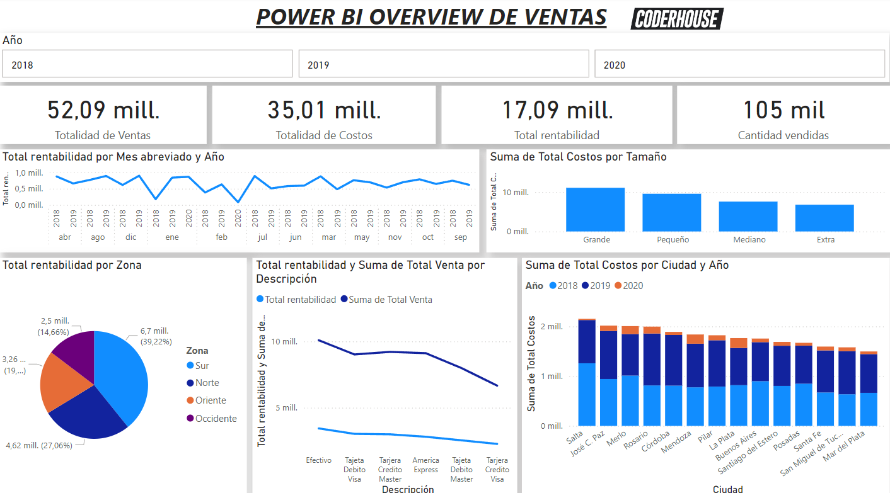
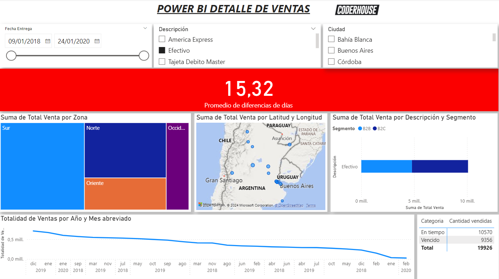

# # 📊 Proyecto de Análisis de Ventas en Power BI

Bienvenido a este proyecto de **Power BI**! 🚀 Aquí encontrarás un dashboard interactivo diseñado para visualizar datos clave y apoyar la toma de decisiones a través de visualizaciones intuitivas.

---

## 📝 Descripción del Proyecto

Este dashboard ha sido creado para ofrecer una vista clara y detallada de métricas y KPIs relevantes. Los datos provienen de conjunto de datos proporcionado por la comisión del curso Coderhouse para fines educativos y de análisis. Estos, han sido limpiados y transformados para su visualización. Con funcionalidades como filtros dinámicos y gráficos interactivos.

---

## 📂 Estructura del Proyecto

- **Archivos de Power BI**: 
  - `EntregaFinal-Guevara.pbix`: Archivo principal de Power BI con visualizaciones, filtros y cálculos DAX.
- **Fuentes de Datos**:
  - Datos cargados desde la carpeta `Fuentes`.
- **Scripts de Transformación**:
  - Transformaciones y limpieza de datos realizadas en el Editor de Power Query.

---

## 🎨 Funcionalidades

- **Visualización de métricas clave**: Obtén una vista de los indicadores de rendimiento más relevantes.
- **Filtros dinámicos**: Filtra los datos por [categorías como fecha, región, producto, etc.].
- **Gráficos interactivos**: Visualizaciones personalizadas como gráficos de barras, líneas, tablas dinámicas y más.
- **Actualización automática**: El dashboard se puede actualizar con nuevos datos para mantener la información al día.

---

## 💻 Requisitos

- **Power BI Desktop**: Para visualizar y modificar el archivo `EntregaFinal-Guevara.pbix`.
- **Fuente de Datos**: Acceso a los datos originales para actualizaciones (si es necesario).

---

## 🚀 Instrucciones de Uso

1. Clona el repositorio o descarga el archivo `EntregaFinal-Guevara.pbix`.
2. Abre el archivo `EntregaFinal-Guevara.pbix` en Power BI Desktop.
3. Asegúrate de que la fuente de datos esté conectada correctamente.
4. Interactúa con los filtros y visualizaciones para explorar los datos.
5. Para actualizar los datos, selecciona **Actualizar** en Power BI.

---

## 📌 Créditos

- **Autor**: Deyvid Guevara Cueva

¡Gracias por explorar este proyecto! Si tienes alguna sugerencia o pregunta, no dudes en contactarme. 😊
